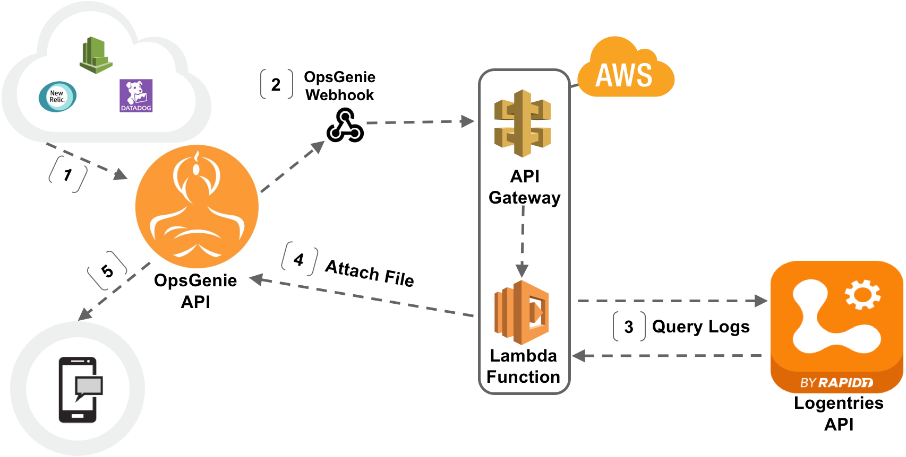

# Logentries & OpsGenie Integration


The integration for Logentries and OpsGenie uses the Logentries REST Query API to enrich alerts from any OpsGenie connected monitoring tool with Logentries data. 

These scripts are
 intended to be run in AWS Lambda and triggered by AWS API Gateway. 

## How it works



1. An OpsGenie integration like Nagios, PTRG, New Relic or Datadog sends an alert to OpsGenie.
2. A key word or phrase from the alert is identified in OpsGenie and the OpsGenie webhook does a GET request to an Amazon API Gateway.
3. This triggers Lambda functions that:
    * Enumerate all of the logs in the Logentries' customer account.
    * Use the Logentries REST Query API to search all logs in the customer’s account for the provided key word or phrase.
    * Returns all Logentries data containing the key word or phrase in the last 20 minutes (configurable). 
4. OpsGenie attaches the results as a file to the alert.
5. The alert from an OpsGenie integration is viewed with the added information of the Logentries log data via the OpsGenie desktop or mobile interface.

* An OpsGenie user can also manually execute the query again from the OpsGenie interface to get the most recent logs.

## Geting Setup

For assistance in setting up the Logentries and OpsGenie integration please reach out to Logentries or OpsGenie Support:
* support@logentries.com
* support@opsgenie.com

### Part I: Prepare, upload, and configure the Lambda scripts

Clone this repository to your local machine. 

#### `lambda.py`
1. In the file `Logentries-OpsGenie/lambda.py`:
    * Add in a Logentries REST API Read-only key on [line 14](https://github.com/LogentriesCommunity/Logentries-OpsGenie/blob/master/Logentries-OpsGenie/lambda.py#L14)
    * On [line 15](https://github.com/LogentriesCommunity/Logentries-OpsGenie/blob/master/Logentries-OpsGenie/lambda.py#L15) add in the Logentries Account Key associated with the API key.
    * Add in the OpsGenie API key on [line 19](https://github.com/LogentriesCommunity/Logentries-OpsGenie/blob/master/Logentries-OpsGenie/lambda.py#L19)
1. Add the ```requests``` library to the same directory as `lambda.py`
    * 
    ```pip install requests -t /path/to/project-dir```
1. Zip up the lambda.py with `requests` library
1. Upload to Lambda
1. In Lambda, update the handler parameter in Lambda configuration to be ```lambda.lambda_handler```

#### `lambdaInvoker.py`

1. Add the ```boto3``` library (provided in the repository) to the same directory as `lambdaInvoker.py`
1. Add the name of the lambda function that you created in step 5 above as the value of FunctionName parameter in `lambdaInvoker.py` script on [line 11](https://github.com/LogentriesCommunity/Logentries-OpsGenie/blob/master/Logentries-OpsGenie/lambdaInvoker.py#L11)
1. Zip up the `lambdaInvoker.py` with boto3 library
1. Create another lambda function in AWS Lambda Service, and upload this zip to Lambda
1. Update the handler parameter in Lambda configuration to be ```lambdaInvoker.lambda_handler```

### Part II: Configure the AWS API Gateway

1. In AWS API Gateway create a new API.
1. Create a new GET method with a Lambda Function integration type. 
1. Specify the Lambda function name for the Lambda function resulting from `lambdaInvoker.py` as detailed above.
1. Configure the Authorization Settings for the GET method

### Part III: Configure OpsGenie

Please contact OpsGenie support: support@opsgenie.com


